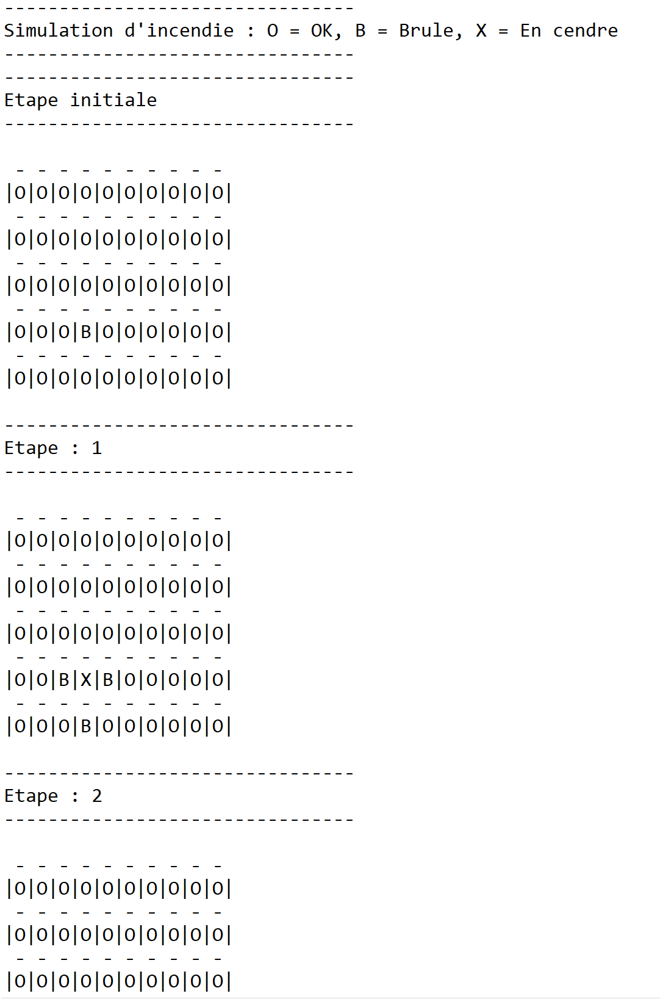

# Simulation de feu de forêt

L'objectif est d'implémenter un algorithme simple de simulation de la propagation d’un feu de forêt.

Durée indicative de l’exercice : < 3h.

 

La forêt est représentée par une grille de dimension h x l.

La dimension temporelle est discrétisée. Le déroulement de la simulation se fait donc étape par étape.

Dans l’état initial, une ou plusieurs cases sont en feu.

Si une case est en feu à l’étape t, alors à l’étape t+1 :

* Le feu s'éteint dans cette case (la case est remplie de cendre et ne peut ensuite plus brûler)

* et il y a une probabilité p que le feu se propage à chacune des 4 cases adjacentes

La simulation s’arrête lorsqu’il n’y a plus aucune case en feu

 

Les dimensions de la grille, la position des cases initialement en feu, ainsi que la probabilité de propagation, sont des paramètres du programme stockés dans un fichier de configuration (format libre).

 

Au minimum, un exécutable en ligne de commande, sans affichage de la grille, est suffisant. Dans ce cas la commande retourne le nombre de cases réduites en cendre à la fin de la simulation, et le nombre d’étapes écoulées.

 

 

L’UI, le dessin de la grille, son animation, ne sont pas requis. Ils sont optionnels.

Le packaging, l’implémentation de tests, ou tout autre élément d’industrialisation que le candidat souhaitera intégrer sont des plus.

 

Note : Vous ne serez pas jugé sur la complétude de l’exercice, vous pouvez donc simplifier les consignes ou faire l’impasse sur certains éléments d’industrialisation. Mais il est important que vous apportiez du soin à la conception et au design du code. Le but est en effet de disposer de code récent de votre part afin de provoquer des discussions techniques.

# Compilation

<pre>
mvn install
</pre>

# Execution

En ligne de commande

<pre>
java -jar forest-0.0.1-SNAPSHOT.jar
</pre>

## Utilisation d'un fichier de configuration externe

Fichier de configuration : file (chemin du fichier)

Exemple d'execution avec un fichier de configuration externe : 

<pre>
java -jar forest-0.0.1-SNAPSHOT.jar "C:\Users\sbrunon\Documents\config.properties"
</pre>

# Fichier de configuration

## Exemple

<pre>
grid.rows=10
grid.columns=5
probability=0.5
start.positions=3,3
</pre>

## Propriétés

* grid.rows = Nombre de colonnes (Integer)
* grid.columns = Nombre de lignes (Integer)
* probability = Probabilité qu'une case voisine brûle. Valeur de 0 à 1. (Float)
* start.positions= Départ de feu. Exemple avec plusieurs positions : 1,3;3,7 (row,column)

NB Une grille commence à 0. Dans le cas ci-dessus, position min : 0,0 et max 9,4

# Résultat

Exemple de résultat 

